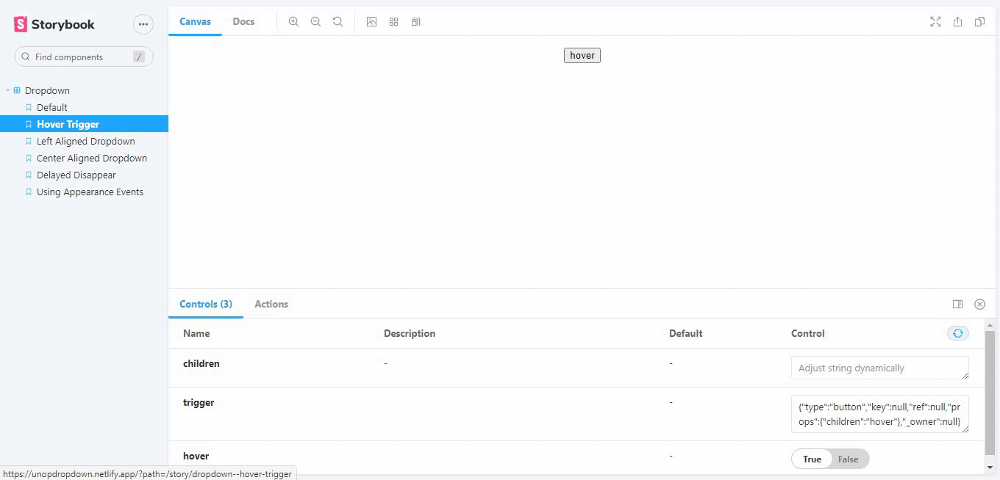

# unop-react-dropdown

Unopinionated dropdown component for react.


### Motivation

I found myself reusing this dropdown logic between different projects.

### Features

- Completely unopinionated (does not enforce any styling whatsoever)
- Lifecycle functions that allow things like animations before the dropdown closes
- Since it's unopinionated, you can turn any element to a dropdown trigger and any element to a drop down menu.
- Includes basic functionality for opening, closing and setting delay before close (for things like a close animation to happen)

### Live Demo

A visual storybook to demonstrate the various component prop behaviour can be found below.

[Web site, docs and demo](https://unopdropdown.netlify.app/)


The hover prop demo


The align prop demo

The other component props, and their options can be found [here](#api)

### Code Sandbox Demo

The component was implemented to create an editable demo dropdown for reference in [code sandbox](https://codesandbox.io/s/modest-cdn-ej284?file=/src/App.js)


Dropdown in code sandbox

Full list of component props, and their options can be found [here](#api)

### Installation

Unop-react-drop down is available as an [npm package](https://www.npmjs.com/package/unop-react-dropdown)

> `npm install unop-react-dropdown`

### Usage

`import UnopDropdown from "unop-react-dropdown";`

and use as:

```jsx
<UnopDropdown trigger={<button>Click</button>}>
  <ul>
    <li>List item 1</li>
    <li>List item 2</li>
  </ul>
</UnopDropdown>
```

> **trigger** is the minimum required prop
> To implement the other props, they can be passed as such:

```jsx
<UnopDropdown
  onAppear={handler}
  onDisappearStart={handler}
  trigger={<button className="AnimatedDropdownButton">Hover</button>}
  delay={300}
  align="CENTER"
  hover
>
  <div>I am random</div>
  <div>I am random</div>
  <div>I am random</div>
</UnopDropdown>
```

Check out the [code sandbox](https://codesandbox.io/s/modest-cdn-ej284?file=/src/App.js) implementation for any clarification.

Full list of component props, and their options can be found [here](#api)

### Help and Contributions

#### How to help/contribute

- fix issues, pull request are very welcome
- write, improve docs
- write tests
- suggest features and improvements

# API

### Component props

| Prop             | Type                          | Default | Description                                                                                                                                     |
| ---------------- | ----------------------------- | ------- | ----------------------------------------------------------------------------------------------------------------------------------------------- |
| trigger          | Jsx.Element                   | none    | This is the only compulsory prop. This will be passed an onClick to handle the toggling when it is rendered. This should prefarably be a button |
| align            | 'RIGHT' or 'LEFT' or 'CENTER' | 'LEFT'  | When 'RIGHT', the dropdown will be rendered below the trigger, aligned to the right. When 'CENTER', the dropdown will be aligned to the center  |
| onAppear         | function                      | null    | This will be called when the dropdown is visible                                                                                                |
| onDisappear      | function                      | null    | This will be called when the dropdown is invisible                                                                                              |
| onDisappearStart | function                      | null    | This will be called when the timeout to diappear(become invisible) starts                                                                       |
| delay            | number                        | 0       | This is the delay in milliseconds before the dropdown goes invisible                                                                            |
| hover            | boolean                       | false   | When true, the dropdown will become visible on hover                                                                                            |

### License

[MIT](https://github.com/AkinAguda/unop-react-dropdown/blob/master/LICENSE)
